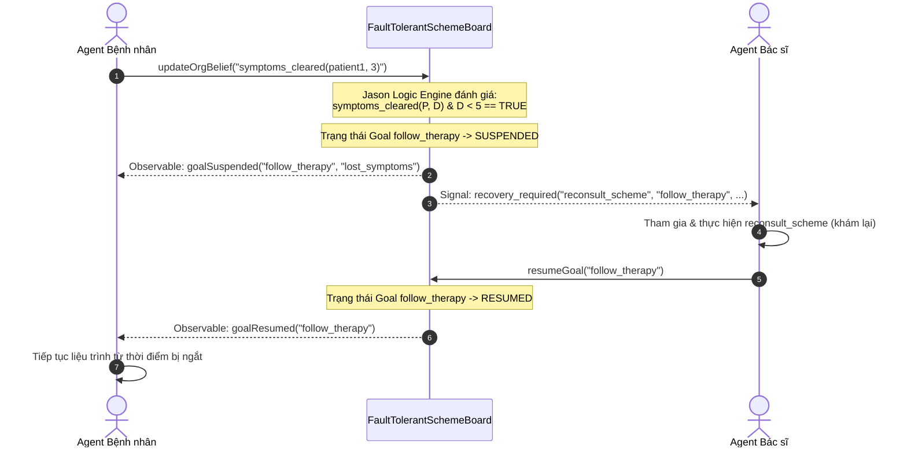

# HƯỚNG DẪN SỬ DỤNG CƠ CHẾ FAILURE & RECOVERY TRONG MOISE (JACAMO)

Tài liệu này hướng dẫn chi tiết cách khai báo, nạp cấu hình và vận hành cơ chế phát hiện lỗi (Failure Detection) cùng kế hoạch phục hồi tổ chức (Recovery Execution) với `FaultTolerantSchemeBoard` trong JaCaMo.

---

## 1. Cấu trúc khai báo trong XML (`sample_org.xml`)

Khối `<failure>` được khai báo trực tiếp bên trong thẻ `<scheme>` thuộc `<functional_specification>`:

```xml
<functional_specification>
    <scheme id="therapy_sch">
        <!-- 1. Cây mục tiêu chuẩn của Scheme -->
        <goal id="therapy">
            <plan operator="parallel">
                <goal id="cpf">
                    <plan operator="sequence">
                        <goal id="consult" />
                        <goal id="prescribe" />
                        <goal id="fill_prescription" />
                    </plan>
                </goal>
                <goal id="follow_therapy" ttf="5 day" />
            </plan>
        </goal>

        <mission id="mPatient" min="1" max="1">
            <goal id="consult" />
            <goal id="follow_therapy" />
        </mission>
        <mission id="mDoctor" min="1" max="1">
            <goal id="prescribe" />
        </mission>
        <mission id="mPharmacist" min="1" max="1">
            <goal id="fill_prescription" />
        </mission>

        <!-- 2. ĐẶC TẢ GIÁM SÁT LỖI VÀ PHỤC HỒI (MỚI) -->
        <failure id="f_follow_therapy" goal="follow_therapy">
            <error id="lost_symptoms">
                <!-- Điều kiện logic dựa trên belief của Agent hoặc trạng thái tổ chức -->
                <condition>
                    <![CDATA[ symptoms_cleared(Patient, Day) & Day < 5 ]]>
                </condition>
                <!-- Danh sách đối số trích xuất từ condition truyền cho ngữ cảnh lỗi -->
                <argument id="patient_id" arity="1" />
                <argument id="cleared_day" arity="1" />
                <argument id="early_recovery_reason" arity="1" />
                <!-- Scheme phục hồi cần kích hoạt khi lỗi xuất hiện -->
                <recoveryact scheme="reconsult_scheme" />
            </error>

            <error id="no_delivery">
                <condition>
                    <![CDATA[ not delivered(PrescriptionId) & ctime(Now) & Now > Deadline ]]>
                </condition>
                <argument id="prescription_id" arity="1" />
                <argument id="delivery_address" arity="1" />
                <argument id="delivery_attempt" arity="1" />
                <argument id="failure_cause" arity="1" />
                <recoveryact scheme="redelivery_scheme" />
            </error>
        </failure>
    </scheme>

    <!-- 3. Scheme phục hồi tương ứng -->
    <scheme id="reconsult_scheme">
        <goal id="reconsult_goal">
            <plan operator="sequence">
                <goal id="review_symptoms" />
                <goal id="adjust_therapy" />
            </plan>
        </goal>
        <mission id="mDoctorReconsult" min="1" max="1">
            <goal id="review_symptoms" />
            <goal id="adjust_therapy" />
        </mission>
    </scheme>
</functional_specification>
```

### Ý nghĩa các thẻ:
* `<failure id="..." goal="...">`: Gắn bộ giám sát lỗi vào mục tiêu `goal`.
* `<error id="...">`: Định danh một ngoại lệ/loại lỗi cụ thể.
* `<condition>`: Biểu thức logic Jason/Prolog dạng `CDATA`. Khi biểu thức này khớp với dữ kiện trong belief base của Board, lỗi sẽ kích hoạt.
* `<argument id="..." arity="...">`: Tên và số lượng tham số cần trích xuất từ phép unifier của `<condition>`.
* `<recoveryact scheme="...">`: Định danh Scheme cứu trợ/phục hồi cần tạo.

---

## 2. Nạp cấu hình trong Java (`FaultTolerantXMLReader`)

Bạn có thể đọc trực tiếp các thông tin lỗi từ tệp XML bằng lớp `FaultTolerantXMLReader`:

```java
import java.io.File;
import java.util.List;
import java.util.Map;
import moise.os.fs.Failure;
import moise.os.fs.ErrorSpec;
import moise.xml.FaultTolerantXMLReader;

// Đọc toàn bộ failure theo từng Scheme trong XML
File osFile = new File("sample_org.xml");
Map<String, List<Failure>> failuresByScheme = FaultTolerantXMLReader.parseFailuresFromFile(osFile);

// Lấy danh sách Failure của scheme 'therapy_sch'
List<Failure> failures = failuresByScheme.get("therapy_sch");
for (Failure f : failures) {
    System.out.println("Giám sát Goal: " + f.getGoalId());
    for (ErrorSpec err : f.getErrors()) {
        System.out.println(" - Error: " + err.getId() + " | Scheme phục hồi: " + err.getRecoveryAct().getScheme());
    }
}
```

---

## 3. Sử dụng `FaultTolerantSchemeBoard`

Lớp `ora4mas.nopl.FaultTolerantSchemeBoard` kế thừa trực tiếp từ `SchemeBoard`. Nó có sẵn các tính năng giám sát lỗi và quản lý trạng thái Goal.

### Khởi tạo Board trong Java hoặc Artifact Configuration:
```java
import ora4mas.nopl.FaultTolerantSchemeBoard;

FaultTolerantSchemeBoard board = new FaultTolerantSchemeBoard();

// Nạp các đặc tả failure từ tệp XML vào Board
board.loadFailuresFromOS("sample_org.xml", "therapy_sch");
```

### Các Operation chính của Board:

| Operation | Cú pháp | Mục đích |
| :--- | :--- | :--- |
| `updateOrgBelief` | `updateOrgBelief(LiteralString)` | Agent đẩy một niềm tin/quan sát lên Board. Board tự động đánh giá `<condition>`. |
| `resumeGoal` | `resumeGoal(GoalId)` | Gỡ trạng thái `suspended`, đưa Goal trở lại thực thi bình thường khi phục hồi thành công. |
| `failGoal` | `failGoal(GoalId)` | Đánh dấu Goal là `failed` vĩnh viễn nếu việc phục hồi thất bại. |

### Các Observable Property & Signal được sinh ra tự động:
* **Khi có lỗi xuất hiện**:
  * Observable Property: `goalSuspended(GoalId, ErrorId)`
  * Signal: `signal("org_error", GoalId, ErrorId, Args)`
  * Signal: `signal("recovery_required", RecoverySchemeId, GoalId, ErrorId, Args)`
* **Khi phục hồi thành công**:
  * Observable Property: `goalResumed(GoalId)` (xóa bỏ `goalSuspended`)
  * Signal: `signal("goal_resumed", GoalId)`
* **Khi phục hồi thất bại**:
  * Observable Property: `goalFailed(GoalId)`
  * Signal: `signal("goal_failed", GoalId)`

---

## 4. Tương tác từ Agent Jason (`.asl`)

### 4.1. Bệnh nhân (`patient.asl`): Đẩy belief lên Board khi có biến chuyển bệnh
```jason
// Bệnh nhân theo dõi triệu chứng. Nếu thấy hết triệu chứng vào ngày thứ 3:
+symptoms_disappeared(Day) : Day < 5 <-
    .print("Toi thay da het trieu chung vao ngay: ", Day);
    // Chia sẻ belief len FaultTolerantSchemeBoard
    updateOrgBelief("symptoms_cleared(patient1, 3)").

// Lắng nghe trạng thái khi Goal bị tạm dừng do lỗi
+goalSuspended("follow_therapy", ErrorId) <-
    .print("Lieu trinh follow_therapy bi tam dung do ngoai le: ", ErrorId);
    // Tạm dừng các hành vi uống thuốc thường nhật để chờ bác sĩ tái khám
    !pause_daily_medication.

// Khi được bác sĩ khám lại và Board phục hồi Goal
+goalResumed("follow_therapy") <-
    .print("Lieu trinh da duoc tiep tuc sau khi tai kham!");
    !resume_daily_medication.
```

### 4.2. Bác sĩ / Điều phối viên (`doctor.asl`): Tiếp nhận Recovery Scheme và phục hồi Goal
```jason
// Bác sĩ nhận tín hiệu cần phục hồi
+recovery_required("reconsult_scheme", FailedGoal, ErrorId, Args) <-
    .print("Yeu cau tao Recovery Scheme: reconsult_scheme cho muc tieu: ", FailedGoal);
    // 1. Tham gia hoặc tạo Scheme reconsult_scheme
    // 2. Thực hiện khám lại và đánh giá triệu chứng
    !perform_reconsultation(Args);
    
    // 3. Sau khi khám lại thành công, gọi resumeGoal để tiếp tục liệu trình chính
    resumeGoal(FailedGoal).

// Nếu sau khi kiểm tra thấy bệnh nhân bị biến chứng nặng không thể tiếp tục liệu trình:
+!handle_unrecoverable_case(FailedGoal) <-
    .print("Khong the phuc hoi lieu trinh!");
    failGoal(FailedGoal).
```

---

## 5. Chu trình hoạt động tổng thể (Workflow)



---

## 6. Chạy kiểm thử tự động (Unit Test)

Bạn có thể kiểm tra toàn bộ luồng hoạt động bằng lệnh Gradle:

```powershell
$env:JAVA_HOME="C:\Program Files\Java\jdk-21"
./gradlew test --tests ora4mas.nopl.FaultTolerantSchemeBoardTest
```
Kết quả kiểm thử sẽ xác nhận:
1. Đọc và phân tích cú pháp chuẩn xác các thẻ trong `sample_org.xml`.
2. Kiểm tra logic đánh giá điều kiện thời gian thực (với $Day \ge 5$ không kích hoạt, $Day < 5$ kích hoạt).
3. Đổi trạng thái mục tiêu sang `suspended`.
4. Gọi `resumeGoal` và `failGoal` chuyển đổi trạng thái chính xác.
