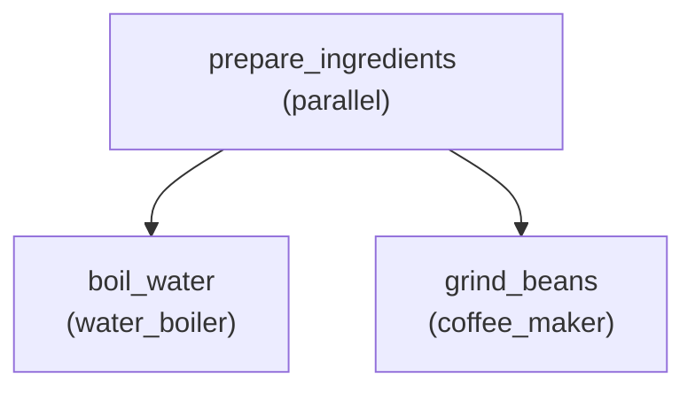

# Ví Dụ Hệ Thống Pha Cà Phê Thông Minh Đa Tác Tử (Coffee Maker MAS)

Ví dụ này mô phỏng quy trình pha chế cà phê thông minh tự động sử dụng nền tảng **JaCaMo** (Jason + CArtAgO + Moise), gồm 2 tác tử chuyên biệt trực quan và tinh gọn cho demo web:
1. **`coffee_maker` (Máy xay & chuẩn bị cà phê)**: Chuẩn bị định lượng, kích hoạt cối xay hạt và tự động xử lý các sự cố về hạt hoặc kẹt cối xay.
2. **`water_boiler` (Máy đun nước thông minh)**: Quản lý mực nước buồng đun (bơm hút `draw_water_from_tank` từ khoang cấp nước bên ngoài), đun sôi đến nhiệt độ tiêu chuẩn (92°C), tự động nạp nước khi khoang cấp thiếu nước và làm nguội khi quá nhiệt.

---

## 🌳 Chu Trình Mục Tiêu Demo Trực Quan (Organizational Goal Scheme)

Hệ thống được thiết kế tinh gọn gồm các mục tiêu trong Moise (`src/org/coffee-org.xml`):



---

## 🏗️ Cấu Trúc Hệ Thống

### 1. Môi Trường (CArtAgO Artifacts)
- **`CoffeeMachineArtifact`**: Quản lý lượng hạt cà phê `beans_level` (g), trạng thái cối xay `grinder_state` và các thao tác xay (`grind_beans`), nạp hạt (`refill_beans`), reset cối (`reset_grinder`).
- **`WaterBoilerArtifact`**: Quản lý dung tích nước buồng đun `water_volume` (ml), khoang cấp nước bên ngoài `supply_reservoir_volume` (ml), nhiệt độ `current_temp` (°C), trạng thái đun `heating_status`, và các thao tác bơm hút (`draw_water_from_tank`), đun (`heat_water_to`), nạp khoang cấp (`refill_supply_tank`), làm nguội (`cool_down`), reset (`reset_boiler`).

### 2. Mô Hình Phục Hồi Lỗi & Thích Ứng (Failure & Adaptation Model)
- **`coffee_team_coordination` (Tổ chức - Group)**:
  - `missing_boiler_agent`: Thiếu máy đun $\rightarrow$ Nhận vai trò `water_boiler_role` & báo bảo trì.
  - `missing_brewer_agent`: Thiếu máy pha $\rightarrow$ Nhận vai trò `coffee_maker_role` & báo bảo trì.
- **`coffee_scheme_execution` (Tổ chức - Scheme)**:
  - `scheme_deadlock`: Tắc nghẽn đồ hình $\rightarrow$ Thay thế scheme khẩn cấp & reset.
  - `brewing_timeout`: Quá hạn pha chế $\rightarrow$ Hủy thao tác xay & dọn dẹp.
- **`coffee_maker` (Tác tử - Goal `grind_beans`)**:
  - `no_beans`: Hết hạt cà phê $\rightarrow$ Tự động thực hiện goal `ensure_required_bean_amount`.
  - `grinder_jammed`: Cối xay kẹt $\rightarrow$ Đảo chiều và reset cối (`unclog_grinder`).
- **`water_boiler` (Tác tử - Goal `boil_water`)**:
  - `insufficient_supply_water`: Khoang cấp không đủ nước $\rightarrow$ Nạp khoang cấp (`refill_supply_tank`) và kích hoạt goal `ensure_sufficient_water_volume` để bơm nước vào buồng đun.
  - `heater_overheated`: Nhiệt độ quá giới hạn $\rightarrow$ Làm nguội về 90°C-92°C (`cooldown_boiler`).

> 📖 Xem hướng dẫn chi tiết và kịch bản thử nghiệm từng bước tại [CASE_STUDY.md](CASE_STUDY.md).

---

## 🚀 Cách Chạy Ứng Dụng

Di chuyển vào thư mục `examples/coffee-maker` và chạy lệnh:

```bash
cd examples/coffee-maker
./gradlew run
# hoặc trên Windows: .\gradlew.bat run
```

Sau đó mở trình duyệt truy cập JaCaMo Web GUI (mặc định tại `http://localhost:3274` hoặc `http://localhost:8080`):
- Hệ thống ở trạng thái **Standby**.
- Nạp belief **`start_coffee`** (hoặc `start_grind` / `start_boil`) vào tác tử để bắt đầu chạy chu trình.
- Truy cập tab **Failure & Adaptation Studio** để giả lập lỗi và theo dõi phục hồi thích ứng.
