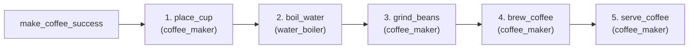

# Ví Dụ Hệ Thống Pha Cà Phê Thông Minh Đa Tác Tử (Coffee Maker MAS)

Ví dụ này mô phỏng quy trình pha chế cà phê thông minh tự động sử dụng nền tảng **JaCaMo** (Jason + CArtAgO + Moise), gồm 2 tác tử chuyên biệt trực quan và tinh gọn cho demo web:
1. **`coffee_maker` (Máy pha cà phê)**: Chuẩn bị ly, xay hạt, thực hiện chiết xuất Espresso 9 Bar và phục vụ cho khách hàng.
2. **`water_boiler` (Máy đun nước thông minh)**: Quản lý nước, đun sôi đến nhiệt độ tiêu chuẩn (93°C) và cung cấp nước nóng chính xác sang máy pha.

---

## 🌳 Chu Trình Mục Tiêu Demo Trực Quan (Organizational Goal Scheme)

Hệ thống được thiết kế tinh gọn gồm **5 mục tiêu tuần tự** rõ ràng trong Moise (`src/org/coffee-org.xml`), rất thuận tiện quan sát và demo trên JaCaMo Web UI:



### Chi Tiết 5 Bước Thực Hiện:

| Bước | Tên Mục Tiêu (Goal ID) | Tác Tử Thực Hiện | Mô Tả Chức Năng |
| :--- | :--- | :--- | :--- |
| **1** | `place_cup` | `coffee_maker` | Kiểm tra và đặt ly vào vị trí khay hứng |
| **2** | `boil_water` | `water_boiler` | Đun sôi nước lên 93°C và xả 50ml nước nóng sang buồng pha |
| **3** | `grind_beans` | `coffee_maker` | Định lượng 18g hạt Arabica & kích hoạt cối xay |
| **4** | `brew_coffee` | `coffee_maker` | Bơm áp suất cao 9 Bar chiết xuất 30ml Espresso |
| **5** | `serve_coffee` | `coffee_maker` | Hoàn tất giao ly cà phê cho khách & xả bã vệ sinh |

---

## 🏗️ Cấu Trúc Hệ Thống

### 1. Môi Trường (CArtAgO Artifacts)
- **`CoffeeMachineArtifact`**: Quản lý lượng hạt cà phê (g), khay chứa bã, cảm biến ly và trạng thái chiết xuất.
- **`WaterBoilerArtifact`**: Quản lý dung tích nước (ml), nhiệt độ hiện tại (°C), trạng thái đun và xả nước.

### 2. Mô Hình Phục Hồi Lỗi (Failure & Recovery Model)
- **`coffee_maker`**:
  - `cup_missing`: Chưa có ly -> Đưa ly mới vào khay (`place_cup_recovery`).
  - `beans_depleted`: Hết hạt cà phê -> Nạp bổ sung 200g hạt mới (`refill_beans_recovery`).
  - `waste_bin_full`: Khay bã đầy -> Đổ và làm sạch khay bã (`empty_waste_recovery`).
  - `pump_pressure_low`: Tụt áp suất -> Cân chỉnh lại hệ thống bơm (`recalibrate_pressure_recovery`).
- **`water_boiler`**:
  - `water_tank_empty`: Hết nước -> Nạp thêm 1000ml nước sạch (`refill_water_recovery`).
  - `overheat_alert`: Quá nhiệt -> Tự ngắt nhiệt & làm mát khẩn cấp (`emergency_cooldown_recovery`).
  - `sensor_error`: Lỗi cảm biến nhiệt -> Hiệu chỉnh & reset sensor (`recalibrate_sensor_recovery`).

---

## 🚀 Cách Chạy Ứng Dụng

Di chuyển vào thư mục `examples/coffee-maker` và chạy lệnh:

```bash
cd examples/coffee-maker
./gradlew run
```

Sau đó mở trình duyệt truy cập JaCaMo Web GUI (mặc định tại `http://localhost:3271` hoặc `http://localhost:8080`) để quan sát trực tiếp sơ đồ tổ chức và tiến trình thực thi các Goal.
