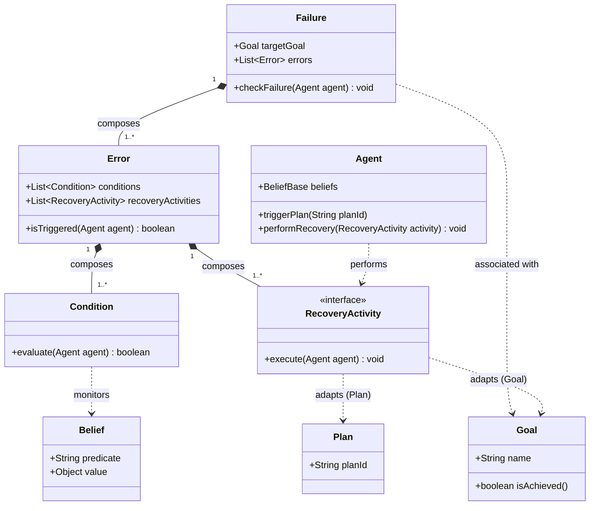

# Failure & Recovery Model Java Mapping

This document details the Java mapping for the Tropos4AS Failure & Recovery dimension integrated into the JaCaMo metamodel.

A **Goal** is associated with a **Failure** condition. The **Agent** performs the **Recovery_Activity** (`perform`), which adapts:
1. A substitute **Plan** (`PlanAdaptation`).
2. An existing or new **Goal** (`GoalAdaptation`).

## 1. Meta-Model Concepts to Java Classes

The failure model contains four core concepts: **Condition**, **Error**, **Failure**, and **Recovery_Activity**. The class diagram below shows their relationships and how they map to Java.



---

## 2. Java Code Skeleton

Below is the Java implementation representing this failure and recovery loop.

### Core Failure Model Structure

#### [MODIFY] [Condition.java](file:///e:/jacamo/src/recovery/Condition.java)
```java
package recovery;

import jason.asSemantics.Agent;

/**
 * Monitors the agent's Belief Base to verify if a failure condition is met.
 */
public interface Condition {
    /**
     * Evaluates the condition based on the agent's beliefs.
     * @param agent The agent instance whose belief base is monitored.
     * @return true if the error condition is active; false otherwise.
     */
    boolean evaluate(Agent agent);
}
```

#### [MODIFY] [Error.java](file:///e:/jacamo/src/recovery/Error.java)
```java
package recovery;

import jason.asSemantics.Agent;
import java.util.ArrayList;
import java.util.List;

/**
 * An Error occurs when its associated monitoring conditions are met.
 * It contains one or more Recovery Activities to resolve the error.
 */
public class Error {
    private final String errorName;
    private final List<Condition> conditions = new ArrayList<>();
    private final List<RecoveryActivity> recoveryActivities = new ArrayList<>();

    public Error(String errorName) {
        this.errorName = errorName;
    }

    public void addCondition(Condition cond) {
        conditions.add(cond);
    }

    public void addRecoveryActivity(RecoveryActivity action) {
        recoveryActivities.add(action);
    }

    /**
     * Checks if all conditions defining this error are active.
     */
    public boolean isTriggered(Agent agent) {
        if (conditions.isEmpty()) return false;
        for (Condition cond : conditions) {
            if (!cond.evaluate(agent)) {
                return false;
            }
        }
        return true;
    }

    public void performRecovery(Agent agent) {
        System.out.println("[Error Handler] Triggering recovery for: " + errorName);
        for (RecoveryActivity activity : recoveryActivities) {
            // The Agent performs the RecoveryActivity
            agent.getTS().getUserAgArch().getTS().getAg().performRecovery(activity);
        }
    }
}
```

#### [MODIFY] [Failure.java](file:///e:/jacamo/src/recovery/Failure.java)
```java
package recovery;

import jason.asSemantics.Agent;
import java.util.ArrayList;
import java.util.List;

/**
 * Failure is associated with a Goal. If any composed Error is triggered,
 * the Failure executes recovery processes.
 */
public class Failure {
    private final String goalId;
    private final List<Error> errors = new ArrayList<>();

    public Failure(String goalId) {
        this.goalId = goalId;
    }

    public void addError(Error error) {
        errors.add(error);
    }

    /**
     * Inspects goals and triggers recovery if errors occur.
     */
    public void monitor(Agent agent) {
        for (Error error : errors) {
            if (error.isTriggered(agent)) {
                System.out.println("[Failure Monitor] Goal '" + goalId + "' failed due to error trigger.");
                error.performRecovery(agent);
            }
        }
    }
}
```

#### [NEW] [ExtendedAgent.java](file:///e:/jacamo/src/recovery/ExtendedAgent.java)
```java
package recovery;

import jason.asSemantics.Agent;

/**
 * Extends the default Jason Agent behavior to perform recovery actions.
 */
public class ExtendedAgent extends Agent {
    
    /**
     * The Agent performs the specific Recovery Activity.
     */
    public void performRecovery(RecoveryActivity activity) {
        System.out.println("[Agent] Performing Recovery Activity...");
        activity.execute(this);
    }
}
```

---

## 3. Adaptation Actions (Recovery_Activity Mappings)

The `RecoveryActivity` interface targets elements within the **Agent dimension**:

#### [MODIFY] [RecoveryActivity.java](file:///e:/jacamo/src/recovery/RecoveryActivity.java)
```java
package recovery;

import jason.asSemantics.Agent;

public interface RecoveryActivity {
    void execute(Agent agent);
}
```

### 1. Plan Adaptation (Selecting substitute/retry Plan)
Triggers a substitute plan or retries plan execution.

#### [MODIFY] [PlanAdaptation.java](file:///e:/jacamo/src/recovery/PlanAdaptation.java)
```java
package recovery;

import jason.asSemantics.Agent;
import jason.asSyntax.Literal;

public class PlanAdaptation implements RecoveryActivity {
    private final String substitutePlanTrigger;

    public PlanAdaptation(String substitutePlanTrigger) {
        this.substitutePlanTrigger = substitutePlanTrigger;
    }

    @Override
    public void execute(Agent agent) {
        System.out.println("[Adaptation -> Plan] Selecting/Triggering plan: " + substitutePlanTrigger);
        agent.getTS().getC().addAchGroup(Literal.parseLiteral(substitutePlanTrigger));
    }
}
```

### 2. Goal Adaptation (Selecting or Creating Goal)
Adapts the active goals by either retrying an existing goal or creating and posting a new goal.

#### [MODIFY] [GoalAdaptation.java](file:///e:/jacamo/src/recovery/GoalAdaptation.java)
```java
package recovery;

import jason.asSemantics.Agent;
import jason.asSyntax.Literal;

public class GoalAdaptation implements RecoveryActivity {
    private final String goalLiteral;
    private final boolean createNew; // true to create/post a new goal, false to retry/select existing

    public GoalAdaptation(String goalLiteral, boolean createNew) {
        this.goalLiteral = goalLiteral;
        this.createNew = createNew;
    }

    @Override
    public void execute(Agent agent) {
        Literal goal = Literal.parseLiteral(goalLiteral);
        if (createNew) {
            System.out.println("[Adaptation -> Goal] Creating and triggering new Goal: " + goalLiteral);
            agent.getTS().getC().addAchGroup(goal);
        } else {
            System.out.println("[Adaptation -> Goal] Selecting and retrying existing Goal: " + goalLiteral);
            agent.getTS().getC().addAchGroup(goal);
        }
    }
}
```
