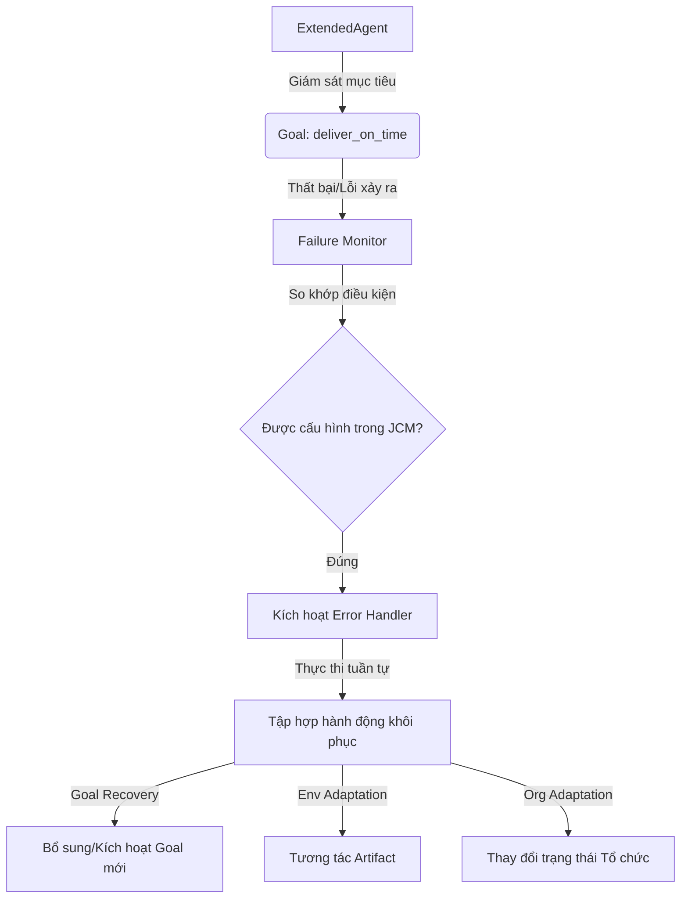

# BÁO CÁO THUYẾT TRÌNH: HỆ THỐNG XỬ LÝ LỖI (FAILURE MODEL) TRÊN JACAMO

Báo cáo này trình bày về kiến trúc xử lý lỗi động (**JaCaMo Failure Model**) và kịch bản demo **Xe Giao Hàng** nhằm chứng minh khả năng tự phục hồi lỗi tự động ở cả 3 mức độ: **Mục tiêu (Goal)**, **Môi trường (Environment)** và **Tổ chức (Organisation)**.

---

## 1. Tổng Quan Kiến Trúc Failure Model

JaCaMo Failure Model là một nền tảng mở rộng tích hợp trực tiếp vào vòng lặp lý trí (Reasoning Cycle) của Agent để giám sát lỗi mục tiêu và tự động kích hoạt các cơ chế khôi phục đã cấu hình trước.

### Các Thành Phần Cốt Lõi:
1. **ExtendedAgent.java**: Wrapper mở rộng của Agent tiêu chuẩn, chịu trách nhiệm đăng ký giám sát mục tiêu tổ chức và đánh chặn sự kiện thất bại của Goal.
2. **Failure.java**: Lớp đại diện cho một bộ giám sát lỗi tĩnh cho một mục tiêu cụ thể, chứa tập hợp các trường hợp lỗi (`Error`) có thể xảy ra.
3. **Error.java**: Lớp định nghĩa cụ thể một lỗi, bao gồm điều kiện kích hoạt lỗi (`conditions`) và danh sách các hành động khôi phục ứng phó (`recovery-activities`).



---

## 2. Kịch Bản Demo: Xe Giao Hàng Đúng Giờ (Delivery Truck)

Kịch bản demo mô phỏng một **Xe Giao Giao Hàng** đảm nhận cả vai trò **Điều phối (Dispatcher)** và **Vận chuyển (Truck)** trong tổ chức, chịu trách nhiệm thực hiện mục tiêu **Giao hàng đúng giờ (`deliver_on_time`)**. 

Hệ thống được thiết kế để vượt qua liên tiếp **2 tình huống lỗi khác nhau** bằng cách thích ứng đa tầng.

### Cấu hình Lỗi và Hành Động Khôi Phục (`my-example.jcm`):
```text
failure deliver_on_time {
    // Tình huống lỗi 1: Kẹt xe nghiêm trọng
    error delivery_delayed {
        conditions: traffic(congested)
        recovery-activities: 
            "goal:plan_route",                  // Kế hoạch lập lại lộ trình (Goal)
            "goal:deliver_on_time",              // Thực hiện lại mục tiêu giao hàng (Goal)
            "env:w1.navigation.speedUp",         // Tăng tốc độ phương tiện (Environment)
            "org:my_team.upgrade_priority"       // Nâng mức ưu tiên đơn hàng (Organisation)
    }
    // Tình huống lỗi 2: Xe hết xăng giữa đường
    error out_of_fuel {
        conditions: fuel(empty)
        recovery-activities: 
            "goal:refuel",                       // Kích hoạt mục tiêu tiếp nhiên liệu (Goal)
            "env:w1.navigation.find_gas_station",// Định vị trạm xăng gần nhất (Environment)
            "org:my_team.request_fuel_allowance" // Yêu cầu ngân sách từ tổ chức (Organisation)
    }
}
```

---

## 3. Nhật Ký Trực Quan Về Luồng Thích Ứng (Demo Timeline)

Quy trình thực thi kịch bản demo diễn ra theo tiến trình 3 chặng khôi phục lỗi liên tiếp:

### Chặng 1: Giao hàng lần 1 & Lỗi kẹt xe
* **Hành động**: Xe xuất phát từ kho (`warehouse`), bắt đầu chạy mục tiêu `deliver_on_time`.
* **Sự cố**: Hệ thống phát hiện kẹt xe nghiêm trọng và kích hoạt niềm tin `traffic(congested)`.
* **Khôi phục**: Failure Model bắt được lỗi, tự động thực thi chuỗi hành động:
  1. Yêu cầu lập lộ trình tránh khu vực kẹt xe (`plan_route`).
  2. Tăng tốc độ xe thông qua thiết bị định vị (`navigation.speedUp`).
  3. Cập nhật trạng thái đơn hàng khẩn cấp (`my_team.upgrade_priority`).

### Chặng 2: Giao hàng lần 2 & Lỗi hết xăng
* **Hành động**: Xe tiếp tục hành trình tránh khu vực kẹt xe với tốc độ cao hơn.
* **Sự cố**: Do chạy tốc độ cao, xe đột ngột hết xăng và kích hoạt niềm tin `fuel(empty)`.
* **Khôi phục**: Failure Model phát hiện lỗi hết xăng, lập tức đình chỉ mục tiêu giao hàng và khôi phục:
  1. Định vị trạm xăng thông qua thiết bị định vị (`navigation.find_gas_station`).
  2. Báo cáo tổ chức xin trợ cấp chi phí xăng dầu (`my_team.request_fuel_allowance`).
  3. Kích hoạt mục tiêu cục bộ của Agent để tiến hành đổ xăng (`refuel`).

### Chặng 3: Tiếp nhiên liệu & Giao hàng thành công
* **Hành động**: Agent tự động lái xe vào trạm xăng để nạp nhiên liệu. Sau khi tiếp xăng thành công, niềm tin `refueled` được kích hoạt.
* **Kết quả**: Agent khởi chạy chặng cuối giao hàng và cập nhật vị trí đã đến nơi (`customer_address`), hoàn thành xuất sắc mục tiêu.

---

## 4. Điểm Nhấn Công Nghệ Cho Bài Thuyết Trình

* **Tách Biệt Logic Xử Lý Lỗi (Decoupling)**: Logic nghiệp vụ giao hàng của Agent Speak (`.asl`) hoàn toàn không chứa mã xử lý ngoại lệ phức tạp. Mọi định nghĩa lỗi và hành động thích ứng đều được khai báo tĩnh tại file cấu hình `.jcm`.
* **Thích Ứng Đa Tầng Cực Kỳ Mạnh Mẽ**:
  * **Goal Recovery**: Chuyển hướng mục tiêu một cách linh hoạt (tạm hoãn giao hàng để đi đổ xăng).
  * **Environment Adaptation**: Thay đổi trực tiếp các trạng thái vật lý của môi trường (tăng tốc độ xe, quét định vị vệ tinh tìm trạm xăng).
  * **Organisation Adaptation**: Tương tác với cơ chế tổ chức của Moise để thay đổi vai trò hoặc mức độ ưu tiên của hoạt động nhóm.
* **Tự Động Hóa Vòng Lặp**: Failure Model tự động xóa bỏ niềm tin lỗi (`traffic(congested)` và `fuel(empty)`) ngay sau khi khôi phục thành công, khôi phục lại trạng thái nhận thức bình thường cho Agent.
