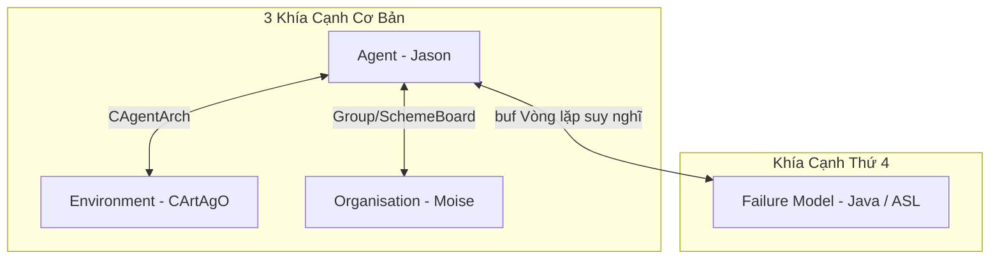

# BÁO CÁO TỔNG KẾT DỰ ÁN JACAMO & FAILURE MODEL (KHÍA CẠNH THỨ 4)

Báo cáo này tổng hợp chi tiết cấu trúc kiến trúc, cơ chế hoạt động, luồng chạy thực tế và kết quả kiểm thử của dự án Multi-Agent System (MAS) kết hợp **4 khía cạnh**: Agent (Jason), Environment (CArtAgO), Organisation (Moise) và Failure Model (Giám sát & Khôi phục lỗi).

---

## 1. Tổng Quan Kiến Trúc Dự Án (4 Khía Cạnh)

Hệ thống được thiết kế dựa trên sự kết hợp hài hòa giữa cấu hình tĩnh của JaCaMo và các lớp Java điều phối động:



### Các Khía Cạnh Chính:
1. **Agent (Jason):** Tác nhân lập luận thông minh sử dụng AgentSpeak (các file `.asl`). Bao gồm:
   - [bob.asl](file:///e:/jacamo/examples/my-example/src/agt/bob.asl) (Boss điều phối tổ chức).
   - [worker.asl](file:///e:/jacamo/examples/my-example/src/agt/worker.asl) (Các Worker thực hiện mục tiêu đếm).
2. **Environment (CArtAgO):** Không gian hoạt động của Agent chứa các Artifact vật lý hoặc phần mềm viết bằng Java:
   - [Counter.java](file:///e:/jacamo/examples/my-example/src/env/tools/Counter.java) (Bộ đếm chia sẻ).
3. **Organisation (Moise):** Quản lý quy định, vai trò, nhóm và tiến độ mục tiêu chung của cả nhóm:
   - [my-org.xml](file:///e:/jacamo/examples/my-example/src/org/my-org.xml) (Đặc tả tổ chức tĩnh).
4. **Failure Model (Giám sát & Khôi phục lỗi):** Khía cạnh thứ 4 tích hợp cả ở mức AgentSpeak (file [recovery.asl](file:///e:/jacamo/examples/my-example/src/agt/recovery.asl)) và ở mức Java lõi của JaCaMo ([ExtendedAgent.java](file:///e:/jacamo/src/main/java/jacamo/platform/ExtendedAgent.java)).

---

## 2. Chi Tiết Hiện Thực Failure Model (Khía Cạnh Thứ 4)

Chúng ta chia việc cứu hộ và phục hồi lỗi thành 3 cấp độ khác nhau để tối ưu hóa tính độc lập và phối hợp trong hệ thống MAS:

### Cấp độ A: Lỗi cá nhân (Individual Recovery)
* **Tình huống:** Khi Worker khởi động trước khi Bob tạo môi trường, Worker sẽ gặp lỗi kết nối cục bộ do không tìm thấy Workspace hoặc Artifact.
* **Giải pháp:** Sử dụng Failure Plan cục bộ `-!safe_setup` và `-!wait_and_adopt_role` trong thư viện dùng chung [recovery.asl](file:///e:/jacamo/examples/my-example/src/agt/recovery.asl).
* **Kết quả:** Agent tự động rơi vào vòng lặp chờ (`.wait`) và thử lại (`retry loop`) âm thầm ở tầng nội bộ mà không làm crash hệ thống và không làm ảnh hưởng đến các Agent khác.

### Cấp độ B: Lỗi phối hợp tập thể (Cooperative Recovery)
* **Tình huống:** Trong khi thực hiện mục tiêu chung của tổ chức (`increment_limit`), `worker1` gặp sự cố mất kết nối vật lý với thiết bị và không thể đếm được.
* **Giải pháp:** 
  1. `worker1` từ bỏ mục tiêu và gửi báo cáo lỗi `work_failed(increment_limit, "Lỗi kết nối Counter")` cho Boss Bob.
  2. Boss Bob tiếp nhận sự cố, đưa ra cảnh báo điều phối lên console và gửi lệnh yêu cầu cứu viện `force_increment` tới `worker2` (Agent rảnh rỗi và đang hoạt động tốt).
  3. `worker2` tiếp nhận yêu cầu cứu viện từ Boss, thực hiện đếm thế chỗ cho `worker1` để hoàn thành chỉ tiêu của nhóm.

### Cấp độ C: Giám sát Failure Model tự động ở mức Java Lõi
* **Hiện thực:** Lớp Java [ExtendedAgent.java](file:///e:/jacamo/src/main/java/jacamo/platform/ExtendedAgent.java) kế thừa từ lớp Agent mặc định của Jason.
* **Nguyên lý hoạt động:**
  * **Lazy Initialization:** Nạp cấu hình `failure-model` tĩnh từ file `.jcm` sau khi `TransitionSystem` khởi tạo xong để tránh lỗi NPE.
  * **Giám sát mỗi Reasoning Cycle:** Ở hàm `buf()` (Belief Update Function), quét qua các Failure đã đăng ký để kiểm tra trạng thái Belief Base.
  * **Tự phục hồi động:** Khi phát hiện Agent có niềm tin lỗi (như `connection(lost)`), Java tự động thu hồi niềm tin đó (đã khử annotations để tránh sót) và tự động kích hoạt Recovery Goal tương ứng (`goal:safe_setup`) đẩy vào hàng đợi của Agent.

---

## 3. Luồng Chạy Hệ Thống Thực Tế (Log Output)

Dưới đây là lịch sử chạy MAS thực tế được ghi nhận tại file [mas-0.log.2](file:///e:/jacamo/examples/my-example/log/mas-0.log.2):

| Dòng Log | Agent | Nội dung in ra | Ý nghĩa luồng chạy |
| :---: | :---: | :--- | :--- |
| 6 | `bob` | `Bob đang chuẩn bị thiết lập môi trường dynamically...` | Bob bắt đầu và chờ 1 giây. |
| 7-11 | `worker1` / `worker2` | `workerX khởi tạo thất bại. Đang thử lại...` | **Lỗi cá nhân:** Các worker tự động thử lại do chưa có môi trường. |
| 19 | `bob` | `Bob quan sát thấy bộ đếm thay đổi: 10` | Bob tạo thành công bộ đếm ban đầu là 10. |
| 20 | `bob` | `--> [THÀNH CÔNG TRƠN TRU] bob...` | Báo cáo Bob hoàn thành trơn tru không gặp lỗi. |
| 21 & 25 | `worker2` / `worker1` | `--> [KHÔI PHỤC THÀNH CÔNG] workerX...` | Báo cáo các worker tự phục hồi lỗi kết nối cục bộ thành công. |
| 26 | `bob` | `Bob: Bắt đầu giai đoạn đếm của tổ chức!` | Kích hoạt sơ đồ mục tiêu chung Moise. |
| 27 | `worker1` | `Tôi là worker1, tôi được giao mục tiêu...` | Moise chỉ định mục tiêu đếm cho `worker1`. |
| 29 | `worker2` | `Tôi là worker2, tôi đang thực hiện mục tiêu...` | Moise chỉ định mục tiêu đếm cho `worker2` (Worker 2 hoàn thành, counter lên 11). |
| 30 | `worker1` | `Tôi là worker1, phát hiện lỗi kết nối thiết bị! Báo cáo...` | **Lỗi phối hợp:** `worker1` giả lập lỗi và báo cáo cho Bob. |
| 31-32 | `bob` | `Boss (Bob): Nhận báo cáo lỗi... Đang điều phối worker2...` | Bob tiếp nhận sự cố và ra lệnh điều phối đếm bù. |
| 35 | `worker2` | `Tôi là worker2, nhận được yêu cầu cứu trợ... Đang đếm thế chỗ...` | `worker2` nhận lệnh cứu viện và tăng bộ đếm lên 12 thành công. |

---

## 4. Hướng Dẫn Chạy & Kiểm Thử Dự Án

Để khởi chạy lại dự án và kiểm tra luồng phối hợp xử lý lỗi này, bạn có thể thực hiện theo các bước sau:

1. **Biên dịch và xuất bản lõi JaCaMo Java sửa đổi vào Maven Local:**
   ```powershell
   # Chạy lệnh tại thư mục e:\jacamo
   $env:JAVA_HOME="C:\Program Files\Java\jdk-21"; ./gradlew publishToMavenLocal
   ```
2. **Khởi chạy ví dụ my-example:**
   ```powershell
   # Chạy lệnh tại thư mục e:\jacamo\examples\my-example
   $env:JAVA_HOME="C:\Program Files\Java\jdk-21"; ./gradlew run
   ```
3. **Quan sát kết quả:** Toàn bộ tiến trình tự khắc phục lỗi cá nhân, báo cáo sự cố và phối hợp đếm thế chỗ sẽ tự động diễn ra và in log chi tiết lên màn hình console.
