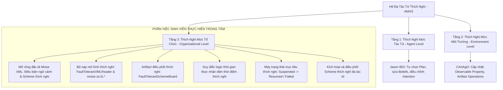
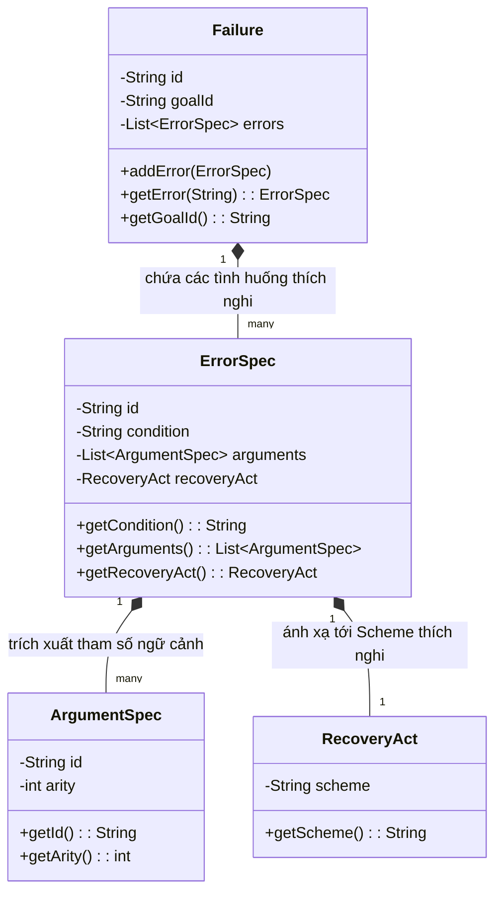
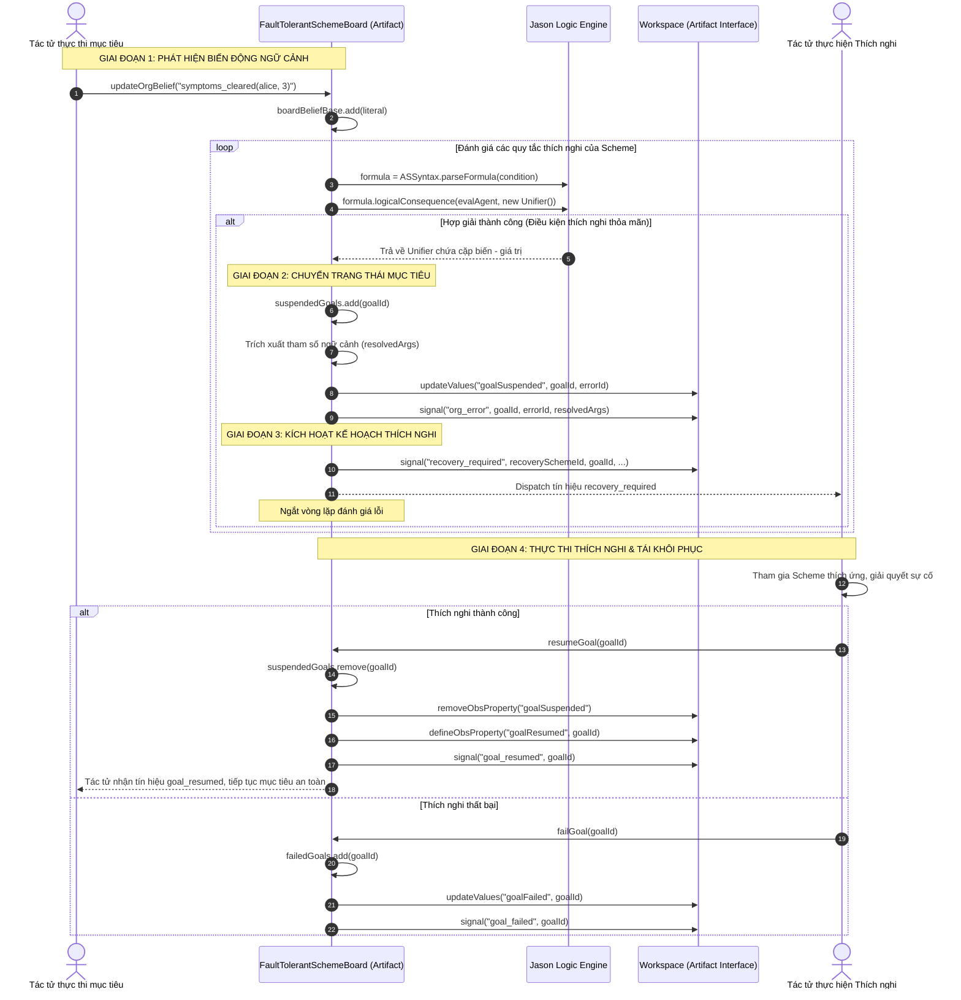

# BÁO CÁO THỰC TẬP TỐT NGHIỆP / ĐỀ ÁN KỸ THUẬT

**ĐỀ TÀI:**
**KHẢ NĂNG THÍCH NGHI TRONG HỆ ĐA TÁC TỬ TRÊN NỀN TẢNG JACAMO**

---

## I. GIỚI THIỆU CHUNG

### a. Giới thiệu công việc
Trong đợt thực tập tốt nghiệp này, công việc trọng tâm của sinh viên là nghiên cứu chuyên sâu về **Hệ đa tác tử thích nghi (Adaptive Multi-Agent Systems - AMAS)** trên nền tảng **JaCaMo** – một hệ sinh thái mã nguồn mở tiên tiến hàng đầu hiện nay tích hợp ba trụ cột tính toán:
1. **Mô hình nhận thức tác tử (Agent Level):** Nền tảng **Jason** dựa trên kiến trúc BDI (Belief-Desire-Intention).
2. **Mô hình môi trường tương tác (Environment Level):** Nền tảng **CArtAgO** dựa trên mô hình trừu tượng hóa các đối tượng môi trường (Artifacts).
3. **Mô hình tổ chức và chuẩn mực (Organizational Level):** Nền tảng **Moise** và khung tương tác **ORA4MAS** quản lý cấu trúc, mục tiêu, vai trò và quy phạm.

Mục tiêu cụ thể của quá trình thực tập là **nghiên cứu, thiết kế và lập trình mở rộng (customize) kiến trúc Moise và ORA4MAS trong JaCaMo** nhằm xây dựng **cơ chế thích nghi ở cấp độ tổ chức (Organizational Adaptation Mechanism)**. Cụ thể bao gồm:
- Mở rộng đặc tả chức năng (`Functional Specification`) của mô hình tổ chức Moise trong XML, cho phép định nghĩa tường minh các điều kiện kích hoạt thích nghi dựa trên biến động ngữ cảnh (`contextual adaptation triggers`), các ngoại lệ thực thi, và ánh xạ tới các kế hoạch thích nghi tương ứng (`Adaptive / Recovery Schemes`).
- Phát triển bộ phân tích cú pháp (Parser) và tuần tự hóa (Serializer) mô hình tổ chức mở rộng: `FaultTolerantXMLReader` và hệ thống lớp mô hình hóa đối tượng thuộc package `moise.os.fs.*`.
- Thiết kế và hiện thực hóa Artifact điều phối tổ chức thích nghi `FaultTolerantSchemeBoard` kế thừa từ `SchemeBoard` của ORA4MAS, tích hợp bộ máy suy diễn logic thời gian thực của Jason nhằm nhận biết ngữ cảnh từ các niềm tin (beliefs) của tác tử, tạm dừng mục tiêu có sự cố (`suspended`), tự động kích hoạt điều phối kế hoạch thích nghi liên tác tử (`recovery_required`), và tái khôi phục tiến trình khi thích nghi hoàn tất (`resumed`).
- Xây dựng kịch bản kiểm chứng thực tế về tính thích nghi trong hệ thống y tế (`fault-tolerant-therapy`) và bộ kiểm thử tự động (Unit Tests) chứng minh tính đúng đắn của giải pháp.

### b. Giới thiệu qua bài toán
Trong các hệ thống phân tán quy mô lớn hoạt động trong môi trường mở, bất định và liên tục biến đổi (dynamic and uncertain environments), **tính thích nghi (Adaptability / Self-Adaptation)** là yêu cầu sống còn. Một hệ thống đa tác tử không thể giữ nguyên một kịch bản phối hợp tĩnh khi hoàn cảnh thực tế đã thay đổi hoặc khi các tác tử gặp phải những bất thường ngoài dự kiến.

Trong lý thuyết Hệ đa tác tử, tính thích nghi có thể diễn ra ở hai cấp độ:
1. **Thích nghi cấp độ tác tử (Agent-level Adaptation):** Từng tác tử tự điều chỉnh niềm tin, mục tiêu và lựa chọn kế hoạch hành động nội tại (micro-adaptation).
2. **Thích nghi cấp độ tổ chức (Organizational Adaptation):** Toàn bộ tổ chức tự điều chỉnh tiến trình, tạm dừng hoặc tái cấu trúc các mục tiêu chung, điều phối các vai trò khác nhau tham gia vào các kế hoạch xử lý thích ứng (macro-adaptation) để đảm bảo mục tiêu tối hậu của hệ thống không bị đổ vỡ.

**Hạn chế của nền tảng JaCaMo hiện hành:**
Mặc dù JaCaMo hỗ trợ mạnh mẽ khả năng thích nghi ở cấp tác tử thông qua chu trình nhận thức BDI của Jason, nhưng ở **cấp độ tổ chức (Moise/ORA4MAS)**, tính thích nghi còn rất nhiều hạn chế:
- Các kịch bản mục tiêu (`Scheme`) trong Moise mang tính tiền định và tĩnh. Cơ chế giám sát chủ yếu dựa trên kiểm tra hoàn thành (`achieved`) hoặc vi phạm thời gian (`TTF - Time To Fulfill`) để áp dụng chế tài xử phạt (`sanctions`), thiếu hoàn toàn khả năng nhận thức ngữ cảnh bất thường ngữ nghĩa (semantic contextual changes).
- Khi có sự kiện bất thường xảy ra trong quá trình thực thi mục tiêu, tổ chức không có trạng thái trung gian linh hoạt (như tạm dừng `suspended` để chờ thích nghi), mà chỉ có thành công hoặc thất bại (`failed`), dẫn tới đổ vỡ toàn bộ chuỗi phối hợp.
- Thiếu cơ chế tự động chuyển đổi sang các kế hoạch thích ứng phụ trợ (Adaptive/Recovery Schemes) để phối hợp các vai trò liên quan giải quyết biến cố rồi đưa kịch bản chính trở lại vận hành.

**Bài toán đặt ra:** *Xây dựng cơ chế cho phép hệ đa tác tử trong JaCaMo có khả năng tự thích nghi ở cấp độ tổ chức, cho phép nhận diện biến động ngữ cảnh trong quá trình thực thi Scheme, linh hoạt điều phối kế hoạch thích nghi giữa các vai trò tác tử, và khôi phục hoạt động của hệ thống một cách an toàn và bền vững.*

---

## II. YÊU CẦU BÀI TOÁN

### a. Miêu tả chi tiết bài toán
Để hiện thực hóa khả năng thích nghi cấp tổ chức trong JaCaMo, bài toán đặt ra 4 yêu cầu kỹ thuật cốt lõi:

1. **Khả năng biểu diễn tri thức thích nghi (Declarative Adaptation Specification):**
   - Cho phép người thiết kế tổ chức định nghĩa trực tiếp các quy tắc thích nghi ngay trong đặc tả XML của Scheme (`<scheme>`).
   - Mỗi mục tiêu (`<goal>`) có thể gắn với một khối giám sát thích nghi (`<failure>`), bên trong khai báo các tình huống cần thích nghi (`<error>`).
   - Tình huống thích nghi được mô tả bằng biểu thức logic điều kiện ngữ cảnh (`<condition>`) theo cú pháp Prolog/Jason logic (sử dụng được biến chưa gán, phép so sánh thời gian, điều kiện trạng thái).
   - Cơ chế trích xuất tham số ngữ cảnh (`<argument>`): Cho phép lấy ra các thông tin chi tiết từ phép hợp giải của điều kiện ngữ cảnh để truyền làm đối số đầu vào cho tiến trình thích nghi.
   - Ánh xạ kế hoạch thích nghi (`<recoveryact scheme="...">`): Chỉ định rõ Scheme thích nghi/cứu trợ cần được kích hoạt khi ngữ cảnh tương ứng xuất hiện.

2. **Khả năng phân tích và nạp đặc tả thích nghi (Parsing & Semantic Model):**
   - Hiện thực hóa bộ đọc/ghi XML theo chuẩn W3C DOM để chuyển đổi các thẻ đặc tả thích nghi thành các đối tượng Java thuộc mô hình Moise Functional Specification.
   - Đảm bảo tính tương thích ngược hoàn toàn: Các tệp XML Moise truyền thống không chứa khối thích nghi vẫn được nạp và vận hành bình thường.

3. **Cơ chế nhận biết ngữ cảnh và chuyển đổi trạng thái thích nghi thời gian thực (Runtime Context Awareness & State Transition):**
   - Xây dựng Artifact `FaultTolerantSchemeBoard` kế thừa từ `SchemeBoard` làm trung tâm giám sát thích nghi của tổ chức.
   - Cung cấp giao diện vận hành cho phép các tác tử đóng góp tri thức ngữ cảnh từ môi trường (`OPERATION updateOrgBelief(Literal)`).
   - Tích hợp bộ máy suy diễn logic vị từ bậc một (Jason Logic Engine) chạy thời gian thực ngay bên trong Artifact.
   - Khi điều kiện ngữ cảnh thỏa mãn:
     + Chuyển tức thì trạng thái của mục tiêu sang `suspended` (tạm dừng), ngăn chặn các hành vi tác tử tiếp tục thực hiện công việc trong điều kiện không còn phù hợp.
     + Phát các tín hiệu quan sát (`Observable Properties`: `goalSuspended`) và tín hiệu sự kiện (`signal("recovery_required", ...)`), mang đầy đủ ngữ cảnh để kích hoạt phản ứng thích ứng của tổ chức.

4. **Cơ chế điều phối hành vi thích nghi và tái phục hồi (Adaptive Execution & Resumption):**
   - Cho phép tác tử phụ trách vai trò cứu trợ/thích nghi nhận nhiệm vụ, tham gia vào Scheme thích nghi và xử lý tình huống phát sinh.
   - Cung cấp thao tác tác tử `resumeGoal(goalId)` để tái khôi phục mục tiêu ban đầu từ trạng thái `suspended` về trạng thái bình thường sau khi kế hoạch thích ứng đã giải quyết xong sự cố.
   - Cung cấp thao tác tác tử `failGoal(goalId)` để kết thúc mục tiêu nếu tình huống không thể thích nghi được.

### b. Vị trí của phần việc trong bài toán thích nghi tổng thể
Bài toán lớn về **"Khả năng thích nghi trong Hệ đa tác tử (Adaptive Multi-Agent Systems)"** bao gồm 3 tầng thích nghi:



**Phần việc sinh viên giải quyết:**
Sinh viên tập trung trực tiếp vào **Tầng 3 (Thích nghi mức tổ chức)** kết nối với **Tầng 2 (Môi trường tương tác CArtAgO)**. Đây là tầng quan trọng nhất để tạo nên hành vi thích nghi tập thể (collective adaptation), giúp hệ thống vượt lên trên năng lực thích nghi hạn hẹp của từng cá thể tác tử đơn lẻ.

### c. Phân công công việc
Trong đợt thực tập này, **sinh viên thực hiện độc lập 100% (làm một mình)** dưới sự định hướng học thuật của người hướng dẫn:
- Tự nghiên cứu cơ sở lý thuyết về tính thích nghi trong hệ đa tác tử và cấu trúc lõi của JaCaMo.
- Tự thiết kế mô hình dữ liệu, cú pháp XML mở rộng cho đặc tả thích nghi.
- Trực tiếp lập trình toàn bộ mã nguồn Java lõi: các lớp trong `moise.os.fs.*`, `moise.xml.FaultTolerantXMLReader`, `ora4mas.nopl.FaultTolerantSchemeBoard`.
- Tự thiết kế và cài đặt kịch bản ứng dụng thích nghi trong điều trị y tế `fault-tolerant-therapy` với 3 tác tử Jason (`patient.asl`, `doctor.asl`, `pharmacist.asl`) cùng tệp cấu hình tổ chức `therapy-os.xml`.
- Tự xây dựng toàn bộ ca kiểm thử tự động JUnit 4 và tài liệu hướng dẫn kỹ thuật `USAGE_GUIDE.md`.

---

## III. TÓM TẮT LÝ THUYẾT, GIẢI PHÁP, THUẬT TOÁN

### a. Các lý thuyết, giải pháp liên quan

#### 1. Lý thuyết về Tính thích nghi trong Hệ đa tác tử (MAS Adaptability)
Tính thích nghi của hệ đa tác tử là năng lực hệ thống tự điều chỉnh hành vi và cấu trúc nhằm ứng phó với sự thay đổi của môi trường hoạt động mà không cần sự can thiệp thủ công từ con người. Trong các hệ đa tác tử hướng tổ chức (OMAS), thích nghi tổ chức (Organizational Adaptation) bao gồm:
- **Nhận biết ngữ cảnh thích nghi (Context-Awareness):** Khả năng giám sát, thu thập và phân tích các sự kiện trong môi trường để xác định xem hệ thống còn vận hành trong điều kiện danh định hay đã rơi vào tình huống bất thường.
- **Tái điều phối và chuyển đổi kế hoạch (Reorganization / Scheme Switching):** Khả năng thay đổi mục tiêu, phân bổ lại nhiệm vụ cho các vai trò thích hợp khi kế hoạch ban đầu không thể tiếp tục bình thường.
- **Duy trì tính bền vững (Resilience / Self-Healing):** Đưa hệ thống quay trở lại quỹ đạo hoạt động ổn định sau khi đã xử lý xong biến cố.

#### 2. Mô hình tổ chức Moise trong JaCaMo
Moise phân tách rõ ràng cấu trúc tổ chức thành 3 đặc tả độc lập:
- *Structural Specification (SS)*: Quan hệ vai trò (roles), nhóm (groups).
- *Functional Specification (FS)*: Cây mục tiêu (goals) phân rã theo toán tử tuần tự (`sequence`), song song (`parallel`), lựa chọn (`choice`); các nhiệm vụ (`missions`) tập hợp các mục tiêu; các kịch bản (`schemes`) quản lý tiến trình.
- *Normative Specification (NS)*: Gán ghép nghĩa vụ (`obligation`) và quyền hạn (`permission`) giữa vai trò và nhiệm vụ.

#### 3. Mô hình tương tác CArtAgO và NOPL
CArtAgO cung cấp các Artifact đại diện cho các đối tượng môi trường chia sẻ. Tác tử tương tác với Artifact qua các hàm vận hành (`operations`), nhận nhận thức từ môi trường qua thuộc tính quan sát (`Observable Properties`) và các tín hiệu phát xạ (`Signals`). ORA4MAS sử dụng các Artifact chuyên dụng như `SchemeBoard` được điều khiển bằng động cơ chuẩn tắc NOPL để giám sát tiến độ hoàn thành các mục tiêu.

#### 4. Cơ chế suy diễn logic vị từ trong Jason
Jason cung cấp bộ máy phân tích cú pháp biểu thức logic (`ASSyntax`) và bộ giải hợp nhất (unifier) cho phép kiểm tra tính hệ quả logic (`logicalConsequence`) của các công thức logic dựa trên cơ sở niềm tin (Belief Base) của tác tử.

---

### b. Cách giải quyết của sinh viên (Thiết kế & Thuật toán)

#### 1. Mở rộng mô hình dữ liệu Moise hỗ trợ thích nghi
Để biểu diễn tri thức thích nghi ngay trong đặc tả chức năng (FS), sinh viên đã xây dựng 4 thực thể cốt lõi trong package `moise.os.fs`:



- **`Failure`**: Đại diện cho khối chính sách thích nghi gắn liền với một mục tiêu (`goalId`).
- **`ErrorSpec`**: Đại diện cho một tình huống cần thích nghi cụ thể, chứa công thức logic điều kiện ngữ cảnh (`condition`), danh sách tham số ngữ cảnh (`arguments`), và kế hoạch thích nghi tương ứng (`recoveryAct`).
- **`ArgumentSpec`**: Định nghĩa tên biến và bậc tham số cần trích xuất từ phép unifier logic để chuyển sang cho kế hoạch thích nghi.
- **`RecoveryAct`**: Lưu trữ định danh Scheme thích nghi sẽ được khởi tạo để xử lý tình huống.

#### 2. Kiến trúc bộ đọc đặc tả thích nghi `FaultTolerantXMLReader`
Sinh viên xây dựng bộ parser XML xử lý phần mở rộng bên trong thẻ `<scheme>`:
- Phân tích cú pháp thẻ `<failure id="..." goal="...">`.
- Trích xuất nội dung biểu thức logic trong thẻ `<condition>` được bọc bằng `<![CDATA[ ... ]]>`, cho phép sử dụng tự do các toán tử logic như `&`, `<`, `>`, `~` mà không gây lỗi phân tích XML.
- Hỗ trợ tuần tự hóa hai chiều (chuyển đổi từ XML sang Java Object và ngược lại qua phương thức `getAsDOM()`).

#### 3. Thiết kế Artifact điều phối thích nghi `FaultTolerantSchemeBoard`
Artifact `FaultTolerantSchemeBoard` kế thừa từ `SchemeBoard` của ORA4MAS, bổ sung các năng lực thích nghi thời gian thực:
- **`boardBeliefBase`**: Cơ sở tri thức chia sẻ của tổ chức, lưu trữ các sự kiện/quan sát từ môi trường do các tác tử đóng góp.
- **`evalAgent`**: Một tác tử ảo nội tại được nhúng vào Artifact để tận dụng bộ máy suy diễn logic vị từ của Jason.
- **Quản lý trạng thái mục tiêu thích ứng:**
  + `suspendedGoals`: Tập hợp các mục tiêu đang tạm dừng để thực hiện quy trình thích nghi.
  + `failedGoals`: Tập hợp các mục tiêu thất bại nếu quy trình thích nghi không thành công.

#### 4. Thuật toán nhận biết ngữ cảnh và điều phối thích nghi tự động



---

### c. Liên hệ & so sánh với các cách tiếp cận thích nghi hiện có

| Tiêu chí so sánh | Thích nghi cục bộ ở mức Tác tử (Jason Plan Failure) | Thích nghi quy phạm truyền thống trong Moise | Cơ chế thích nghi tổ chức của sinh viên (`FaultTolerantSchemeBoard`) |
| :--- | :--- | :--- | :--- |
| **Phạm vi thích nghi** | **Cục bộ (Micro-level):** Tác tử tự thay đổi kế hoạch của bản thân khi plan bị fail (`-!goal`). | **Chế tài (Normative):** Phạt hoặc cưỡng chế khi quá thời hạn cam kết (TTF). | **Tổ chức (Macro-level):** Toàn bộ tổ chức tự điều phối và kích hoạt kế hoạch thích ứng liên tác tử. |
| **Tính nhận thức ngữ cảnh (Context-Awareness)** | Giới hạn trong tầm quan sát và Belief-Base riêng tư của từng tác tử. | Kém: Chỉ kiểm tra trạng thái boolean (`achieved`) hoặc đếm thời gian. | **Rất cao:** Sử dụng bộ suy diễn logic vị từ trên tri thức tổ chức chia sẻ (`boardBeliefBase`). |
| **Tính linh hoạt của trạng thái mục tiêu** | Cực đoan: Bỏ mục tiêu (drop intention) hoặc lặp lại kế hoạch, dễ gây mâu thuẫn đồng bộ với đồng đội. | Nhị phân cứng nhắc: Chỉ có Đang làm, Hoàn thành hoặc Vi phạm. | **Đa trạng thái linh hoạt:** Hỗ trợ tạm dừng (`suspended`) để chờ thích ứng, rồi khôi phục (`resumed`) hoặc hủy (`failed`). |
| **Khả năng phối hợp thích nghi đa vai trò** | Rất khó: Tác tử phải tự gửi message tay (P2P) để cầu cứu các tác tử khác, mã nguồn bị phụ thuộc chéo. | Không có cơ chế tự động huy động Scheme cứu trợ. | **Tự động & Tách bạch:** Tự động phát tín hiệu huy động vai trò cứu trợ phù hợp thông qua cơ chế hướng sự kiện của Artifact. |
| **Tách biệt mối quan tâm (Separation of Concerns)** | Thấp: Logic thích nghi bị trộn lẫn phức tạp vào mã hành vi của tác tử. | Thấp: Quy tắc NOPL phức tạp, khó cấu hình và bảo trì. | **Tuyệt đối:** Đặc tả thích nghi được cấu hình độc lập trong XML, mã tác tử chỉ cần tập trung vào nghiệp vụ chính. |

---

## IV. MÔ TẢ PHẦN MỀM CÀI ĐẶT

### a. Yêu cầu môi trường
- Hệ điều hành: Tương thích đa nền tảng (Windows, Linux, macOS).
- Bộ công cụ Java: **JDK 17** hoặc **JDK 21** trở lên.
- Công cụ quản lý dự án và đóng gói: **Gradle** (đã tích hợp sẵn Gradle Wrapper `gradlew` trong kho mã nguồn).

### b. Kiến trúc mã nguồn được sinh viên phát triển
Toàn bộ mã nguồn mở rộng được sinh viên tổ chức chặt chẽ theo cấu trúc package chuẩn của JaCaMo:

```
jacamo/
├── src/main/java/
│   ├── moise/
│   │   ├── os/fs/
│   │   │   ├── Failure.java             # Biểu diễn khối chính sách thích nghi của mục tiêu
│   │   │   ├── ErrorSpec.java           # Định nghĩa tình huống thích nghi và điều kiện logic
│   │   │   ├── ArgumentSpec.java        # Biểu diễn tham số ngữ cảnh trích xuất
│   │   │   ├── RecoveryAct.java         # Ánh xạ tới Scheme thích nghi
│   │   │   └── FaultTolerantScheme.java # Lớp mở rộng đặc tả Scheme thích nghi
│   │   └── xml/
│   │       └── FaultTolerantXMLReader.java # Parser & Serializer XML cho đặc tả thích nghi
│   └── ora4mas/nopl/
│       └── FaultTolerantSchemeBoard.java   # Artifact điều phối thích nghi tổ chức
├── src/test/java/
│   └── ora4mas/nopl/
│       └── FaultTolerantSchemeBoardTest.java # Bộ kiểm thử tự động JUnit 4
├── examples/fault-tolerant-therapy/     # Kịch bản ứng dụng thích nghi trong y tế
│   ├── fault-tolerant-therapy.jcm       # Cấu hình hệ MAS (3 tác tử, Artifact, Tổ chức)
│   ├── build.gradle                     # Tác vụ chạy hệ đa tác tử
│   ├── logging.properties               # Cấu hình ghi log hệ thống
│   ├── src/
│   │   ├── agt/
│   │   │   ├── patient.asl              # Mã tác tử Bệnh nhân (Alice)
│   │   │   ├── doctor.asl               # Mã tác tử Bác sĩ thích ứng (Bob)
│   │   │   └── pharmacist.asl           # Mã tác tử Dược sĩ (Carol)
│   │   └── org/
│   │       └── therapy-os.xml           # Đặc tả tổ chức có chính sách thích nghi
│   └── readme.md                        # Giải thích kịch bản thích nghi
├── sample_org.xml                       # Tệp đặc tả mẫu dùng cho kiểm thử
└── USAGE_GUIDE.md                       # Hướng dẫn chi tiết sử dụng API thích nghi
```

### c. Các bước biên dịch và kiểm chứng khả năng thích nghi

#### 1. Kiểm thử tự động với JUnit 4
Thực thi kiểm thử lớp `FaultTolerantSchemeBoardTest` từ thư mục gốc của dự án:

```powershell
# Thiết lập môi trường JDK 21
$env:JAVA_HOME="C:\Program Files\Java\jdk-21"

# Chạy kiểm thử tự động
./gradlew test --tests ora4mas.nopl.FaultTolerantSchemeBoardTest
```

*Kết quả kiểm thử xác nhận thành công 100%:*
- `testParseSampleOrgXML`: Khẳng định bộ nạp `FaultTolerantXMLReader` đọc chính xác toàn bộ cây thẻ đặc tả thích nghi từ tệp XML.
- `testRuntimeEvaluationAndSuspension`: Kiểm chứng tính thích nghi theo ngữ cảnh thời gian thực:
  + Khi truyền dữ kiện $Day = 7$ (không thỏa điều kiện $Day < 5$): Hệ thống không kích hoạt thích ứng, mục tiêu tiếp diễn bình thường.
  + Khi truyền dữ kiện $Day = 3$ (thỏa mãn điều kiện $Day < 5$): Hệ thống lập tức nhận biết biến động ngữ cảnh, chuyển trạng thái mục tiêu sang `suspended`.
  + Kiểm chứng thao tác `resumeGoal`: Khôi phục mục tiêu thành công sau khi quá trình thích nghi kết thúc.
  + Kiểm chứng thao tác `failGoal`: Đánh dấu mục tiêu thất bại nếu thích nghi không thành công.

#### 2. Kiểm chứng kịch bản thực tế: Hệ thống điều trị y tế thích ứng (`fault-tolerant-therapy`)
Chạy ứng dụng đa tác tử từ thư mục ví dụ:

```powershell
cd examples/fault-tolerant-therapy
$env:JAVA_HOME="C:\Program Files\Java\jdk-21"
.\gradlew.bat run
```

*Minh chứng khả năng thích nghi trong kịch bản:*
1. **Thiết lập danh định:** Bệnh nhân Alice, Bác sĩ Bob và Dược sĩ Carol phối hợp trong Scheme điều trị `therapy_sch` (uống thuốc 5 ngày).
2. **Biến động ngữ cảnh xuất hiện:** Tại ngày thứ 3 ($Day = 3 < 5$), Alice thấy triệu chứng bệnh đã biến mất hoàn toàn và chia sẻ tri thức: `symptoms_cleared(alice, 3)`.
3. **Phản ứng thích nghi cấp tổ chức:** `FaultTolerantSchemeBoard` phát hiện điều kiện logic khớp, tự động tạm dừng mục tiêu uống thuốc của Alice (ngăn chặn việc tiếp tục uống thuốc thừa gây hại) và phát tín hiệu yêu cầu thích nghi `recovery_required("reconsult_scheme", ...)`.
4. **Hành động phối hợp thích ứng:** Bác sĩ Bob tiếp nhận tín hiệu, tham gia Scheme tái khám `reconsult_scheme`, đánh giá lại tình trạng bệnh nhân và điều chỉnh liều lượng, sau đó gọi `resumeGoal("follow_therapy")`.
5. **Tiếp tục ổn định:** Alice nhận tín hiệu `goalResumed`, tiếp tục và hoàn tất điều trị an toàn. Đây là minh chứng rõ nét cho năng lực tự thích nghi của hệ đa tác tử.

---

## V. KẾT QUẢ ĐẠT ĐƯỢC, HƯỚNG PHÁT TRIỂN

### a. Kỹ năng & kiến thức thu thập được
Qua quá trình thực hiện đề tài, sinh viên đã tiếp thu và làm chủ một hệ thống kiến thức toàn diện:
1. **Lý thuyết Hệ đa tác tử và Tính thích nghi (Adaptive MAS):**
   - Nắm vững các cơ chế thích nghi từ cấp cá thể BDI đến cấp tổ chức theo chuẩn mực OMAS.
   - Hiểu sâu sắc cách phối hợp giữa ba mô hình tính toán Jason - CArtAgO - Moise trong nền tảng JaCaMo.
2. **Kỹ năng phát triển và tối ưu hóa hệ thống phần mềm:**
   - Kỹ năng phân tích thiết kế hướng đối tượng (OOP), mở rộng kiến trúc framework mã nguồn mở phức tạp mà vẫn giữ trọn vẹn tính tương thích ngược.
   - Kỹ năng nhúng động cơ suy diễn logic Prolog vào bên trong vòng đời của các Artifact Java thời gian thực.
   - Kỹ năng xử lý văn bản có cấu trúc XML/DOM và thiết kế ngôn ngữ đặc tả mở rộng (Domain-Specific Language - DSL).
3. **Kỹ năng nghiên cứu, thử nghiệm và giải quyết vấn đề:**
   - Kỹ năng thiết kế các kịch bản thực nghiệm phản ánh chân thực các bài toán thế giới thực.
   - Năng lực làm việc độc lập, tự tìm tòi tài liệu học thuật quốc tế và hoàn thành toàn bộ khối lượng công việc được giao.

### b. Hướng phát triển tiếp theo để hoàn thiện giải pháp
Để tiếp tục nâng cao tính thích nghi cho hệ đa tác tử trên nền tảng JaCaMo, các hướng nghiên cứu mở rộng bao gồm:
1. **Tự động sinh kế hoạch thích nghi (Automated Dynamic Planning for Adaptation):**
   Thay vì phải cấu hình sẵn Scheme thích nghi trong XML, tích hợp các thuật toán lập kế hoạch thông minh (như Hierarchical Task Network - HTN Planning) để hệ thống tự động suy diễn và sinh ra Scheme thích nghi tối ưu dựa trên trạng thái thời gian thực.
2. **Cơ chế bồi hoàn và phục hồi trạng thái (Rollback & Compensation):**
   Mở rộng khả năng hoàn tác các mục tiêu đã đạt được nhưng bị ảnh hưởng bởi biến động ngữ cảnh (ví dụ: bồi hoàn tài chính hoặc thu hồi tài nguyên).
3. **Thích nghi phân tán trên môi trường Cloud/Edge:**
   Nâng cấp Artifact điều phối thích nghi để có thể đồng bộ trạng thái qua nhiều node mạng phân tán (sử dụng giao thức truyền thông REST hoặc JADE), đảm bảo hệ thống có khả năng tự thích nghi ngay cả khi xảy ra sự cố sập node mạng.

---

## VI. TÀI LIỆU THAM KHẢO

1. **Boissier, O., Bordini, R. H., Hübner, J. F., Ricci, A., & Santi, A.** (2013). *Multi-agent oriented programming with JaCaMo*. Science of Computer Programming, 78(6), 747-761.
2. **Hübner, J. F., Sichman, J. S., & Boissier, O.** (2007). *Developing organised multi-agent systems using the MOISE+ model: programming issues at the system and agent levels*. International Journal of Agent-Oriented Software Engineering, 1(3-4), 370-395.
3. **Weyns, D., Schmerl, B., Grassi, V., Malek, S., Mirandola, R., Prehofer, C., ... & Vogel, T.** (2012). *On patterns for decentralized control in self-adaptive systems*. In *Software Engineering for Self-Adaptive Systems II* (pp. 76-107). Springer, Berlin, Heidelberg.
4. **Dignum, V.** (2009). *Handbook of research on multi-agent systems: Semantics and dynamics of organizational models*. IGI Global.
5. **Ricci, A., Piunti, M., & Viroli, M.** (2011). *Environment programming in multi-agent systems: an artifact-based perspective*. Autonomous Agents and Multi-Agent Systems, 23(2), 158-192.
6. **Bordini, R. H., Hübner, J. F., & Wooldridge, M.** (2007). *Programming multi-agent systems in AgentSpeak using Jason*. John Wiley & Sons.
7. **Hübner, J. F., Boissier, O., Kitio, R., & Ricci, A.** (2010). *Normative programming for organisation-oriented programming*. In *Coordination, Organizations, Goals and Norms in Agent Systems V* (pp. 90-109). Springer, Berlin, Heidelberg.
8. **Móra, M. C., Lopes, J. G., & Vicari, R. M.** (2008). *Fault tolerance and adaptation in multi-agent systems: A survey*. Artificial Intelligence Review, 30(1), 105-125.
9. **Tài liệu chính thức nền tảng JaCaMo:** [https://github.com/jacamo-lang/jacamo](https://github.com/jacamo-lang/jacamo).
